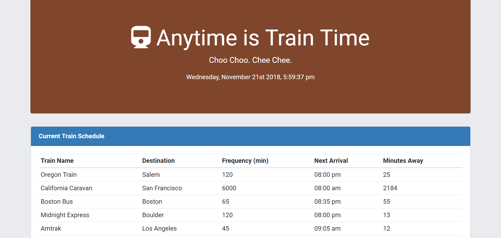
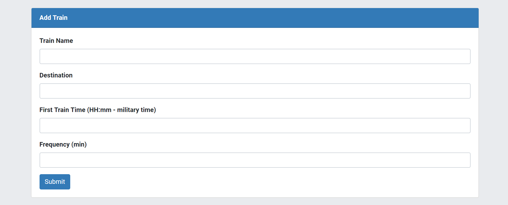

# Train Scheduler

# Project Description

TrainScheduler is an application that provides up-to-date information about various trains, namely their arrival times and how many minutes remain until they arrive at their station. The user enters and submits the name of the train, the destination, the time of the first train, and the frequency of the train (in minutes). When the user clicks Submit, the name of the train and its destination is displayed, as well as its frequency. The time of the train's next arrival is calcualted in relation to the current time, as well as how many minutes away the next arrival is. The user can add as many trains as desired.

This application uses JavaScript and jQuery, as well as HTML and CSS, including Bootstrap. Firebase is used to host arrival and departure data. This information is retrieved and manipulated with Moment.js. The font used ('Roboto') comes from Google Fonts. The favicon and the icon used is from Font Awesome.

# Technologies Used

* Firebase
* jQuery
* JavaScript
* Bootstrap
* CSS
* HTML

# Train Scheduler Live Link

Please check out the live link for Train Scheduler here:

https://answebdev.github.io/TrainScheduler/

# Screenshots

